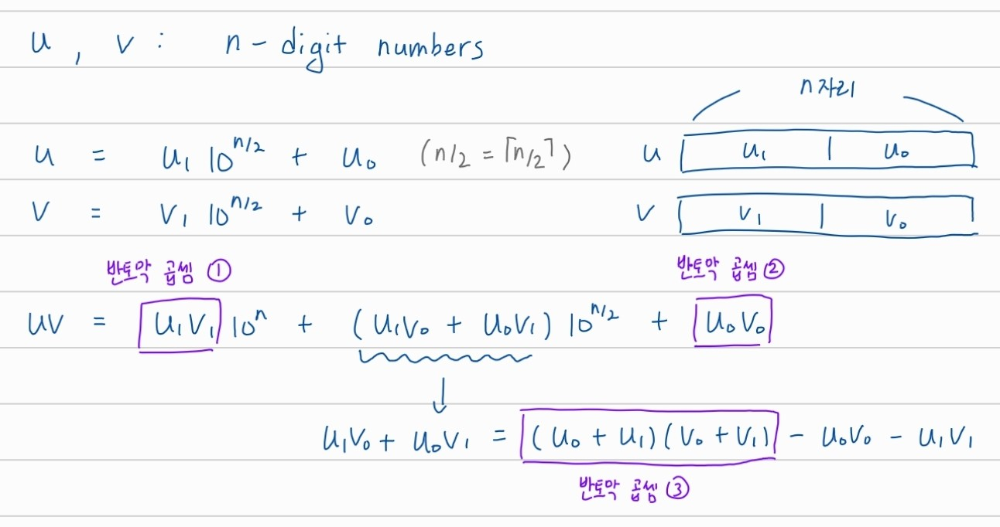
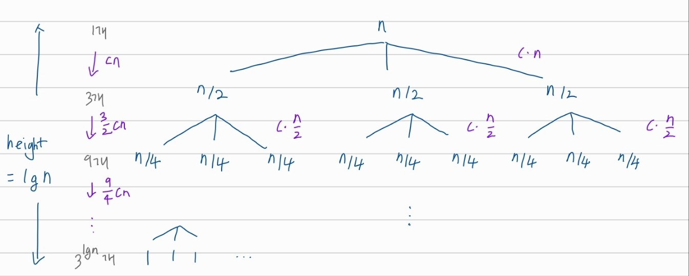
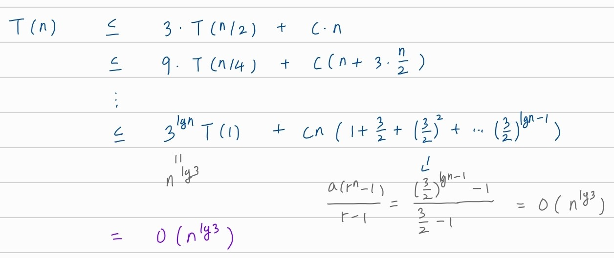

## Divide and Conquer

# Karatsuba's method for Integer Multiplication


## 2토막으로 나눠서 곱하기



n자리 숫자 두 개를 반토막 내서 곱할 때 곱셈은 3번이면 충분


## pseudo code

```
mult(u, v)	// u, v: n-digit #'s
{
	if u, v are one-digit #'s
		return u * v
	else
		u1, v1: first n/2 digits of u, v
		u0, v0: remaining n/2 digits of u, v
		u0v0 <- mult(u0, v0)
		u1v1 <- mult(u1, v1)
		w <- mult(u0 + u1, v0 + v1) - u0v0 - u1v1
		return u1v1 * 10^n + w * 10^(n/2) + u0v0	
}
```

한 자리 수면 바로 곱해서 리턴

두 자리 이상이면 반토막 곱하기 3번 해서 계산, 리턴


## 시간복잡도






## 일반화: k토막으로 나눠서 곱하기

