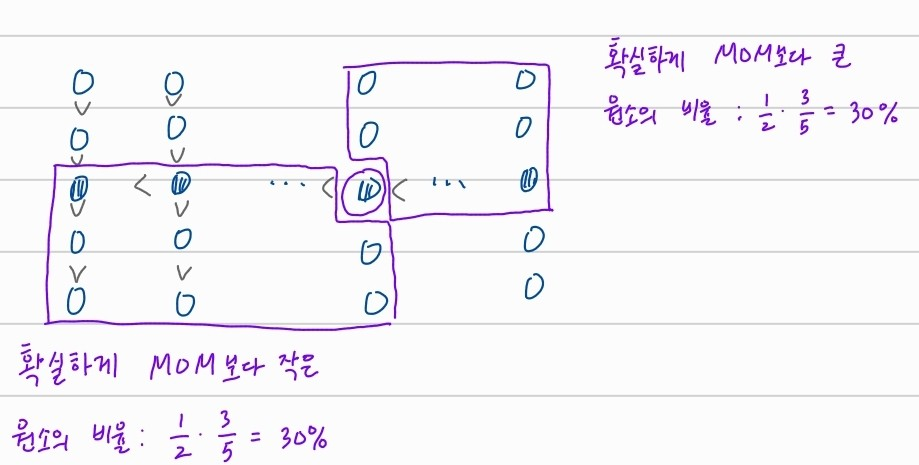

## Divide & Conquer: k<sup>th</sup> statistic problem

# DSelect

```
DSelect(A[1...n], k)
{
  1. Find medians of subgroups of size 5
  2. DSelect(M[1...⌜n/5⌝], ⌜n/10⌝): Find MOM(pivot)
  3. Partition A using MOM: [less than MOM]MOM[greater than MOM]
  4. if k == j
       return pivot
     if k < j
       DSelect(A[1...j-1], k)
     if k > j
       DSelect(A[j+1...n], k-j)
}
```


## 시간복잡도: O(n)

1. MOM 찾기: T(n/5)

2. 다음 DSelect: ≤ T(7n/10)



 배열 A를 MOM을 기준으로 partition 시

- MOM보다 작은 원소의 비율은 30% 이상 -> MOM보다 큰 원소의 비율은 70% 이하
- MOM보다 큰 원소의 비율은 30% 이상 -> MOM보다 작은 원소의 비율은 70% 이하

A: [   ≤ 70% ] MOM [   ≥ 70% ]

나머지 작업들은 각각 linear time 안에 처리되므로  O(n)

-> `T(n) ≤ T(n/5) + T(7n/10) + Cn`

***

linear time으로 작동되는 것을 수학적 귀납법으로 증명

```
T(n) ≤ l*n -> T(n/5) ≤ l*n/5, T(7n/10) ≤ l*7n/5
T(n) ≤ T(n/5) + T(7n/10) + Cn
     ≤ l*n/5 + l*7n/5 + Cn
     ≤ l*9n/10 + Cn  (..if l=10C)
     ≤ 10Cn
     = O(n)
```


