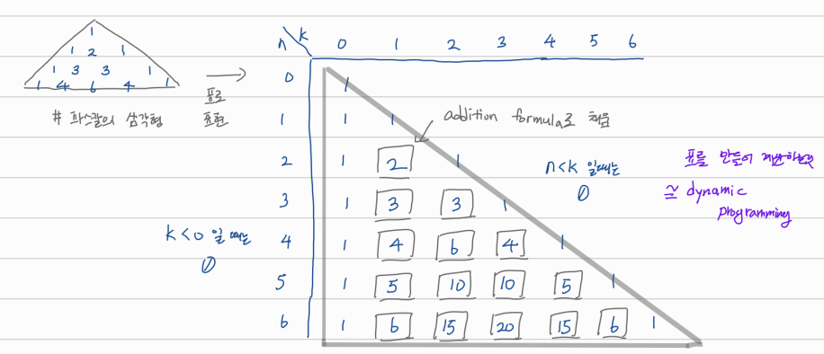

## dynamic programming

중복 계산을 막기 위해 표를 만들기

표가 효율적으로 채워지도록 계산 순서 구성

# Binomial Coefficients

## definition

이항계수 점화식 (파스칼의 삼각형)

- bin(n, 0) = 1, bin(n, n) = 1
- bin(n, k) = bin(n - 1, k) + bin(n - 1, k - 1)

정의 그대로 코드를 짜면

```
# following recursive function
def binom1(n, k):
  if n < 0 or k < 0 or n < k: return 0
  if k == 0 or k == n: return 1
  return binom1(n - 1, k) + binom1(n - 1, k - 1)
```

중복 계산 엄청 많이 일어남; O(n!)이라고 함

## top-down으로 짜기

```
# top-down style dynamic programming
def memorize(f):
  memo = {}
  def helper(x, y):
  if (x, y) not in memo:
    memo[x, y] = f(x, y)
  return memo[x, y]
  return helper

def binom2(n, k):
  if n < 0 or k < 0: return 0
  if n < k: return 0
  if k == 0: return 1
  if k == n: return 1
  return binom2(n - 1, k) + binom2(n - 1, k - 1)
```

recursion으로 처리

## bottom-up으로 짜기

```
# bottom-up style dynamic programming
def binom3(n, k):
    memo = {}
    if n < 0 or k < 0: return 0
    if n < k: return 0
    # boundaries first
    for i in range(0, n + 1):
        memo[i, i] = 1
        memo[i, 0] = 1
    # interior
    for i in range(2, n + 1):
        for j in range(1, i):
            memo[i, j] = memo[i - 1, j] + memo[i - 1, j - 1]
    return memo[n, k]
```

경계값 먼저 초기화 시킨 뒤 차례대로 계산해서 채워넣음

## 시간복잡도: O(n<sup>2</sup>)



표의 반절만 구하면 되니까

T(n, k) = O(n*k), ʘ(k) = n

-> T(n, k) = O(n<sup>2</sup>)

