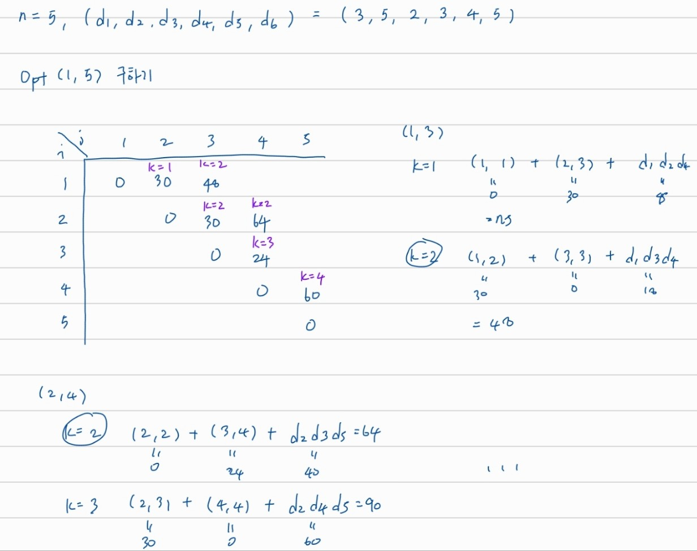
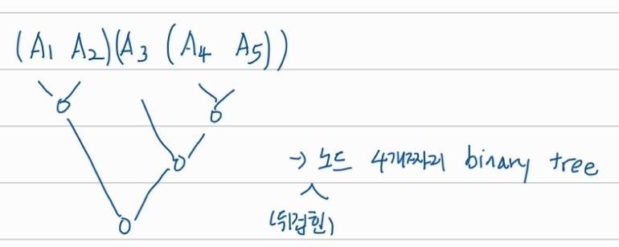

## dynamic programming

# Chained Matrix Multiplication

A1 x A2 x ... x An 을 optimal 하게 (원소들의 곱셈 횟수가 최소가 되도록) 구하려면

(Ak의 사이즈: dk x dk+1, 1 ≤ i ≤ j ≤ n) 

- Opt(i, j) = min{Opt(i, k) + Opt(k + 1, j) + didk+1dj+1}

- Opt(i, i) = 0

## enumeration of binary trees with n nodes

행렬의 곱셈 우선순위는 뒤집힌 binary tree로 나타낼 수 있다

즉 n개의 행렬을 곱셈하는 방법의 개수는 노드 n-1개짜리 binary tree의 개수와 같다

***

노드 n개짜리 binary tree 개수: tn

- tn = t0tn-1 + t1tn-2 + ... + tn-1t0
- t0 = 1

노드 k개 짜리 왼쪽 서브트리 개수 *  노드 n - k - 1개짜리 오른쪽 서브트리 개수 k = 0 ~ k = n - 1 에 대해서 더한거임; 왼쪽 서브트리 노드 개수 + 오른쪽 서브트리 노드 개수 = n - 1
