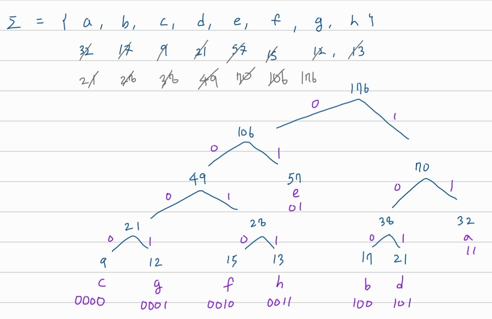
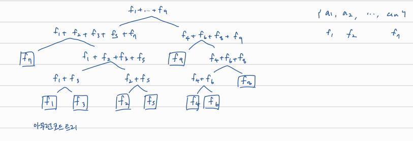

## Greedy

# Huffmon code (and data compression)

symbol --(encode)--> code

code --(decode)--> encode

각 symbol에는 특정 codeword가 배정되어 있음

## prefix-free code

: 어떤 codeword가 다른 codeword의 prefix가 아닌 경우 --> decode 가능함

binary tree로 표현 가능하면 prefix-free code임

- external node -> symbol
- path -> word

## 가장 짧게 encoding하는 code 찾기

각각의 symbol의 등장 횟수가 정해져 있을 때 가장 짧게 encoding 하려면

빈도의 합이 가장 작게 나오도록 묶는 것을 반복해서 binary tree 만들기

그 결과로 빈도가 낮은 것들은 아래쪽에 있을 가능성이 크고, 빈도가 높은 것들은 위쪽에 있을 가능성이 큼; 아래쪽에 있을 수록 codeword의 길이가 길어짐

이는 optimal한 결과임; 즉 그리디한 방식이라는 뜻

## Huffman code의 cost

cost = d1f1 + d2f2 ... + d9f9	// external node 값 x depth

​    = (f1 + f3) + (f2 + f5) + ... + (f1 + ... + f9)	// inner node들의 합

## Constructions and Running time

1. O(n2logn): sort at each iteration
2. O(n2): find the two smallest frequencies at each iteration
3. O(nlogn): User priority queue (heap): two pop's + one push at each iteration
4. sort + O(n):  queue A에 정렬된 상태로 넣고 pop된 원소를 B에 집언허음 (B도 정렬된채 들어옴).  A.top과 B.top 비교