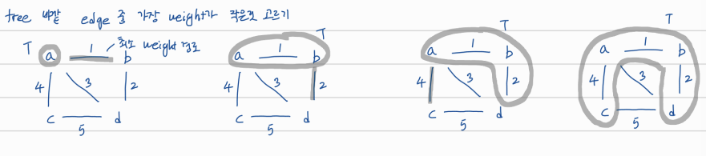

## MST를 greedy하게 만드는 방법 1

# Prim's algorithm



노드 하나 골라서 트리에 집어넣고, 그 트리에서 가장 가까운 에지와 연결된 외부 노드 골라서 트리에 추가시킴 ... 모든 노드가 트리에 포함될 때까지 반복

(그림 오류: 세 번째 그래프에 d도 포함되어야 함)


# Basic Implementation: O(nm)

input: connected undirected weighted G, adj_list로 나타내짐

output: MST의 edge들

```
Init: 
  X <- {s}  s: arbitraily chosen vertex
  T <- {}   T: chosen edges, initially empty
Main Loop:
  for n-1 interations:
    Among edges (u, v) with (u in X), (v not in X)
    Take (u*, v*) with minimum weight
    Add v* into X
    Add (u*, v*) into T
  return T
```


# Implemantation with Heap: O((n+m)logn)

```
Init:
  X <- {s}
  T <- {}
  Q: heap-based priroty queue
  for each v != s:
    if there is edge(s, v)
      key(v) <- w(s, v); e(v) <- (s, v)
    else
      key(v) <- INF; e(v) <- NULL
    push(v)
    
Main Loop:
  while Q is not empty:
    v* <- pop()
    Add v* into X
    Add e(v*) into X
    for each edge(v*, y) with (y not in X):
      if w(v*, y) < key(y):
        update key(y) <- w(v*, y)
        e(y) <- (v*, y)
  return T

```

여기서 Q에 들어가는 것은 T에 포함되지 않는 노드들이다. Q의 prirority는 현재까지 만들어진 트리인 T에서의 거리. Q에 있는 노드 v*를 하나씩 X에 추가시킨다. 또한 그 노드와 트리를 연결하는 edge인 e(v\*)도 추가시킨다.

key(y)는 y가 현재 트리에서 떨어져 있는 거리. 트리와 직접 연결된 edge가 없으면 INF. 트리에 새로운 값 v\*이 추가되고 나서, y와 v\*사이의 edge의 거리가 이전 iteration에서의 트리와의 거리 즉 key(y)보다 작으면 key(y)를 y와 v*사이의 거리로 업데이트.

시간복잡도

- Init: O(nlogn)
- Main Loop: O(nlogn) + O(mlogn)

