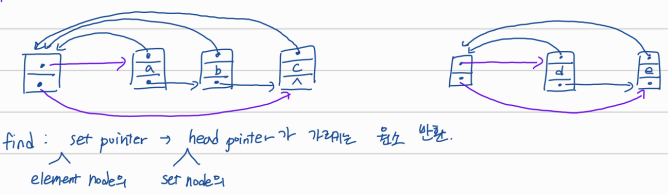
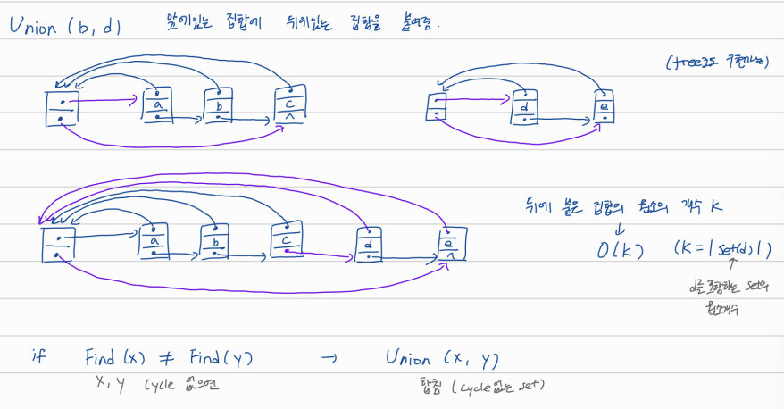
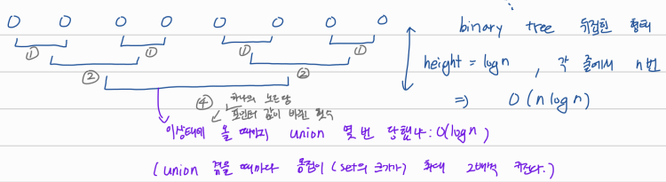

## MST를 greedy하게 만들기 2

# Kruskal's algorithm

edge들을 오름차순으로 나열해놓고, S와 사이클을 만들지 않을 경우 S에 하나씩 추가한다. 모든 edge에 대해 한 사이클 다 돌면 S는 MST됨.


# Basic Implementation: O(mn)

```
Preprocessing:
  S <- {}  // chosen edges
  Sort edges by weights

Main Loop:
  for each edge e, in increasing order of weights:
    if S and e does not make cycle:
      Add e into S
  return S
```

- sort: O(mlogn)
- 반복문 O(m)번 돈다
- DFS나 BFS로 사이클 여부 확인: O(n)


# Implementation with disjoint set data structure: O((n+m)logn)

```
Preprocessing:
  S <- {}
  Sort edges by weights
  for each vertex x makeset(X)

Main Loop:
  for each edge e = (u, v) in increasing order by weight
    if Find(u) != Find(v)
      Add e into S
      Union(u, v)
  return S
```

- sort: O(mlogn)
- 모든 노드들에 대해 makeset: O(n)
- Find: O(1), 최대 m번 반복하니까 O(m)
- Union은 최대 n-1번 가능함: O(nlogn)

# disjoint set data structure

disjoint set data structure을 이용하면 사이클의 발생 여부를 더 빠르게 판단할 수 있다.

- **Find(x): O(1)**, x가 속한 집합의 대표 원소 반환



- **Union(x, y): O(nlogn)**, y가 속한 집합을 x가 속한 집합에 포함시킴. find와 union을 이용하면 cycle 없는 두 집합을 합쳐서 새로운 cycle없는 집합을 만들 수 있다.



>  union이 최대한 일을 빨리 처리하게 위해서 원소의 개수가 큰 집합 안에 개수가 작은 집합을 포함시킨다. 이 경우에 가장 많이 일하는 경우는 똑같은 크기의 집합을 합하는 경우.
>
> 
>
> n개의 원소에 대해 각 줄에서 n번을 height=logn만큼 반복할 수 있으므로 최대 O(nlogn)만큼 일한다.