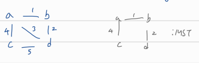

## Greedy

# Minimum Spanning Trees (MST)

G: 모든 노드가 연결되고 방향성 없는 edge, weight 있음 (weighted undirected connected graph)

G에서 MST 찾기

MST: 모든 노드가 연결되고 edge의 weight가 최소인 graph

# MST 특징

1. 사이클 없음 -> 그래서 트리라고 부름
2. MST안의 아무 edge 하나 삭제하면, 나머지는 더이상 서로 연결 안됨
3. MST 안의 노드 a와 b 사이에는 하나의 길만 존재
4. n개의 노드가 연결되어 있으므로 n-1개의 edge 가지고 있음 (undirected async graph 특징)