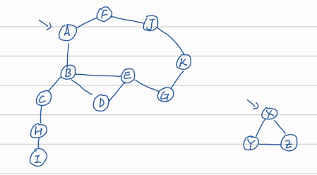
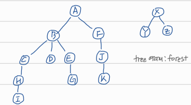
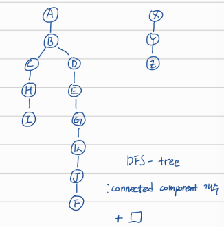
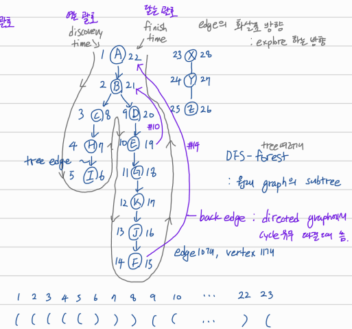

## Graph

# Graph Search



이 그래프를 두 가지 방법으로 search 가능

**Breath-First-Search (BFS)**



		- shortest-path
		- connected component

**Depth-First-Search (DFS)**



- connected component
- DFS를 돌릴때 time stamp를 찍으면 다양한 알고리즘을 돌리는데 써먹을 수 있다.


# Implementation of DFS with time stamp

```
t = 0
DFS(S)
{
  state[s] <- DISCOVERED
  t <- t + 1; d[s] <- t  // discovery time
  for each neighbor v of s:
    if state[v] == UNDISCOVERED:
      parent[v] <- s
      DFS(v)
  state[s] <- PROCESSED
  t <- t + 1; f[s] <- t  // finish time
}
```



time stamp를 이용해 discovery time에 여는 괄호, finish time에 닫는 괄호를 만들 수 있다.

두 꼭짓점 u, v에 대해 두 가지 경우가 있을 수 있다.

- 하나가 다른 하나 안에 속한다.
  - d(u) < d(v) < f(v) < f(u): u가 v의 자손
- 교집합 없음
  - d(u) < f(u) < d(v) < f(v): u와 v가 자손관계가 아님