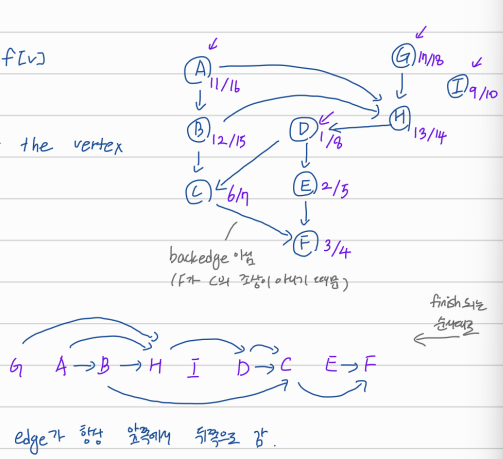

## graph: DFS

# Topological Sort

edge의 방향이 있고 cycle이 없는 그래프에 대해(**directed async graph, DAG**) 주어지는 partial order를 linear order로 만드는 방법이다.

1. DFS를 돌려서 모든 노드들에 대한 `f[v]`를 계산한다.
2. 각 노드들을 finish time이 감소하는 방향으로 나열한다. (맨 오른쪽에 있는 원소가 제일 처음에 finish된 것이다.)

그 결과로 나온 리스트를 보면 edge가 항상 뒤쪽 방향으로 향하는 것을 알 수 있다.

directed graph에서 cycle이 있는지는 backedge를 통해 알 수 있다. DFS-tree를 만드는 과정에서 backedge가 발견되면 cycle이 있다는 뜻이다.

