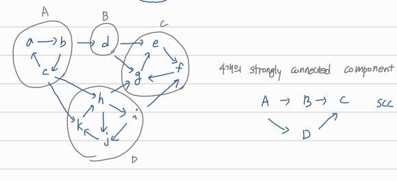
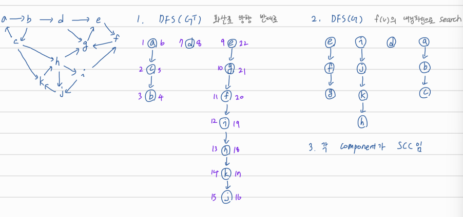
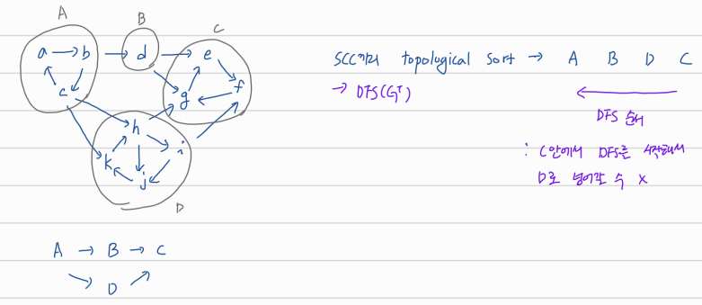

## graph

# Strongly Connected Components (SCC)

directed graph에서 cycle이 생기는 부분기리 묶은 것을 strongly connected components라고 한다.

directed graph의 SCC를 묶어서 graph를 만든 것을 SCC graph라고 한다. SCC graph는 항상 cycle이 없는 directed graly이다. (DAG, directed async graph)

# SCC algorithm

1. DFS(GT): 기존 그래프의 edge방향을 모두 반대로 돌려서 DFS를 실행하고 time stamp를 찍는다.
2. DFS(G): 1번의 결과에서 나온 f(v)의 내림차순으로 DFS를 돌려 dfs tree를 만든다.
3. 2번의 결과로 나온 각 component가 SCC가 된다.

(1번 과정은 SCC끼리 topological sort를 하는 과정으로, 2번 과정 계산 시 한 component에서 다른 component로 DFS를 통해 이동하는 것을 막는다.)