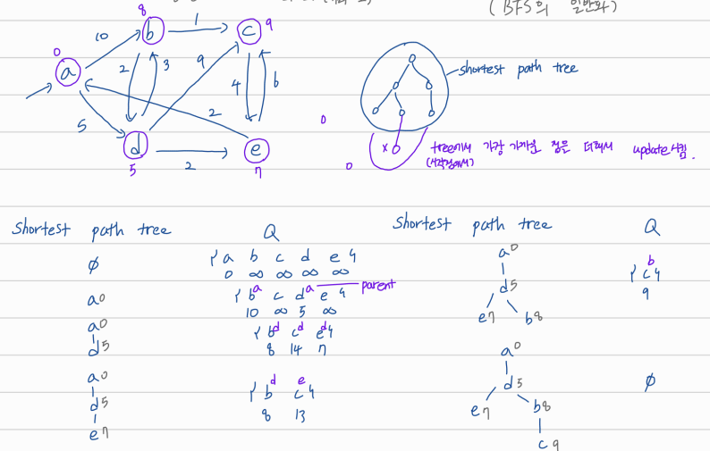

## graph: shortest path

# Dijkstra's Shortest path Algorithm

BFS의 일반화로, directed weighted graph에서의 최단경로를 찾는 알고리즘. 하나의 source에 대한 shortest path를 계산한다.



prim's aogirhtm으로 MST를 만들 때와 마찬가지로, shortest path tree와 가장 가까운 거리의 노드들 하나씩 추가하면서 남은 Q에 대해 계산하는 것을 반복한다.

# Implementation of Dijkstra Algorithm: O((m+n)logn)

```
S: starting vertex
Q: heap based priority queue
parent[]: array for shortest path tree

Init:
  for each vertex v:
    d[v] <- INF
    push(v)  // O(n)
  d[s] <- 0

Main Loop:
  while Q is not empty:
    u <- pop  // 반복 포함 O(nlogn)
    for each neighbor v (in Q) of u:
      if d[u] + w(u, v) < d[v]:
        d[v] <- d[u] + w(u, v) // 반복 포함 O(mlogn)
        parent[v] <- u
```

