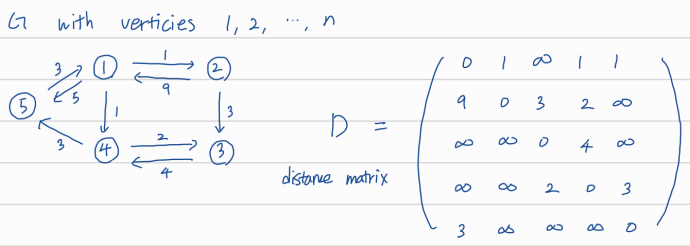
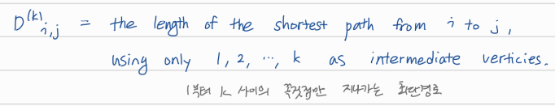
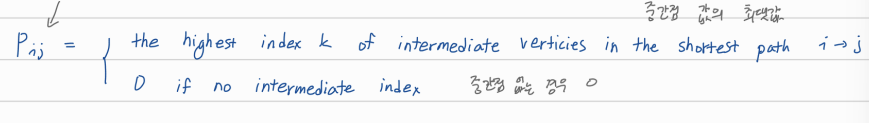

## graph: shortest path

# Floyd's Algorithm for all-pairs shortest paths

n개의 노드를 가지는 그래프 G에 대해서 n x n 크기의 distance matrix를 만들 수 있다.



위의 D matrix는 D<sup>(0)</sup>을 나타낸 것으로 edge 한 개 이하로 지나면서 갈 수 있는 경로의 최소길이이다. 



**D<sup>(k)</sup><sub>i, j</sub> = min(D<sup>(k-1)</sup><sub>ij</sub>, D<sup>(k-1)</sup><sub>ik</sub> + D<sup>(k-1)</sup><sub>kj</sub>)** 

위 식을 이용해 dynamic programming 방식으로 반복적으로 계산하면 모든 출발지와 목적지에 대한 최소 경로를 알 수 있다.

경로를 역추적하기 위한 용도로 P<sub>i,j</sub>를 다음과 같이 정의한다.




# Implementation: O(n<sup>3</sup>)

```
p = 0  // global nxn array

floyd(D)
{
  Init: D(0) <- D // input: D
  
  Main Loop:
    for (k = 1; k <= n; k++)
      for (i = 1; i <= n; i++)
        for (j = 1; j <= n; j++)
          if (D(k-1)[j, k] + D(k-1)[k, j] < D(k-1)[i, j])
            D(k) <- D(k-1)[j, k] + D(k-1)[k, j]
            P[i, j] <- k
          else
            D(k) <- D(k-1)[i, j]
}

path(i, j) // for print shortest path
{
  if (P[i, j] != 0)
    path(i, P[i, j])
    print(P[i, j])
    path(P[i, j], j)
}
```

기존의 k-1번 까지의 노드를 경유해서 간 경로와 k를 포함하는 경로를 비교해서 최솟값을 할당해준다. k를 지나가는 경우가 최솟값인 경우 P[i, j]를 k로 업데이트 해주어, path함수 실행 시 중간 경로로 k가 출력될 수 있게 한다. path 함수는 DFS 방식으로 지나는 경유지를 출력한다.