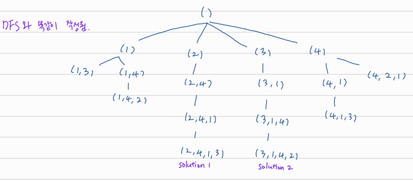

## backtracking

## 

# n-queen

n x n 보드에 n개의 퀸을 가로, 세로, 대각선 방향으로 겹치지 않게 배치하기.

```
tuples(x, k, n)
{
  for (x[k] = 1; x[k] <= n; x[k]++)
    if (check(x, k))
      if(k == n)
        print(x)
      else
        tuples(x, k + 1, n)
}

check(x, k)
{
  for (i = 1; i < k; i++)
    if (x[i] == x[k] || x[i] - x[k] == i - k || x[i] - x[k] == k - j)
      return 0
  return 1
}
```



DFS와 비슷하지만 조건을 만족시키지 않을 때 다음 단계로 가지 않음으로서 훨씬 빠르게 실행 가능해진다.


# General Framework for Basic Backtracking

Problem: Find all tuples(x<sub>1</sub>, ..., x<sub>n</sub>) that satisfies P(x<sub>1</sub>, ..., x<sub>n</sub>) where x<sub>i</sub> in D<sub>i</sub>, a domain of integers.

- D<sub>i</sub>는 변수의 범위로 n-queen에서는 1 <= x<sub>i</sub> <= n, 스도쿠에서는 1 <= x<sub>i</sub> <= 9 이다.

Backtracking: Invent "cutoff" predicate P<sub>k</sub>(x<sub>1</sub>, ..., x<sub>k</sub>) st.

- (B1) P<sub>k</sub>(x<sub>1</sub>, ..., x<sub>k</sub>) holds whenever P<sub>k+1</sub>(x<sub>1</sub>, ..., x<sub>k+1</sub>) holds.
- (B2) P<sub>k</sub>(x<sub>1</sub>, ..., x<sub>k</sub>) is easy to test if P<sub>k+1</sub>(x<sub>1</sub>, ..., x<sub>k+1</sub>) holds.